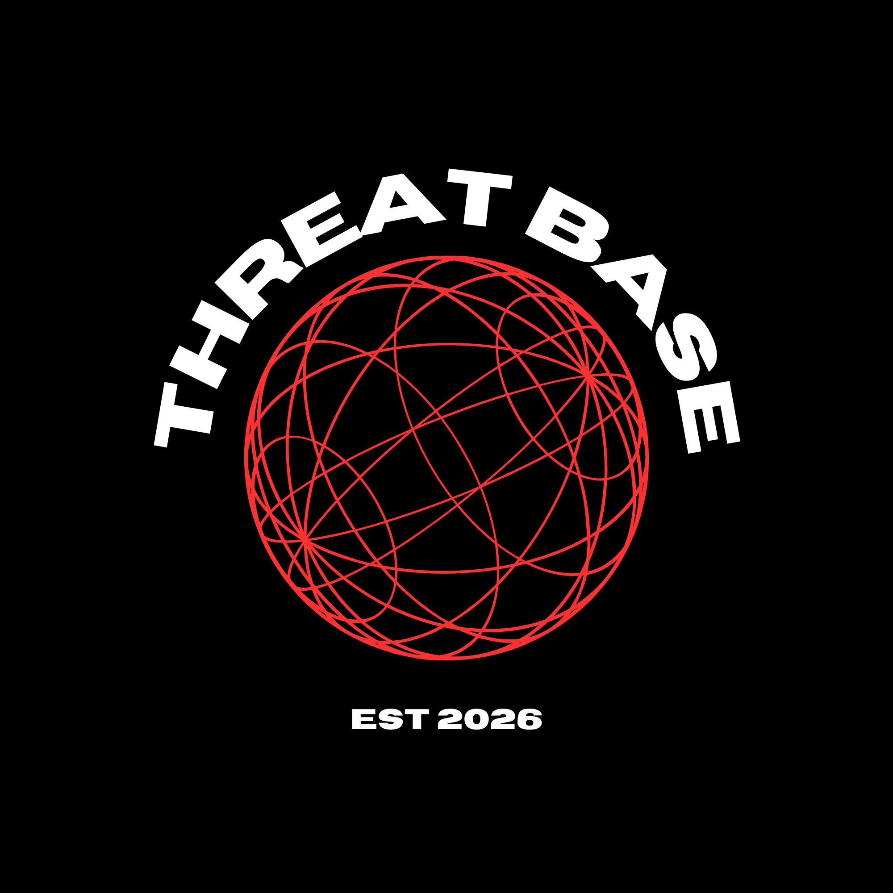

<div align="center">
  <br/>
  

  <h1>⚔️&nbsp; Threatbase</h1>

  <p><strong>Enterprise-grade, open-source threat intelligence.</strong><br/>Automated · Deduplicated · Zero-cost.</p>

  <p>
    <a href="https://github.com/kalidada18/threatbase/actions/workflows/update-feed.yml"></a>
    
    
    
    
    
  </p>

  <p>
    <a href="https://threatbase.qzz.io"><b>🌐 Live Dashboard</b></a>
    &nbsp;·&nbsp;
    <a href="#-using-the-feeds"><b>📥 Raw Feeds</b></a>
    &nbsp;·&nbsp;
    <a href="https://github.com/kalidada18/threatbase/releases"><b>📦 Archives</b></a>
    &nbsp;·&nbsp;
    <a href="https://threatbase.qzz.io/thanks"><b>🙏 Sources</b></a>
  </p>

  <br/>

  <em>Built to democratize access to high-quality threat intelligence — one indicator at a time.</em>

</div>

<br/>

---

## 🧩 What is Threatbase?

Threatbase is a **fully-automated threat-intelligence pipeline**. It ingests, validates, and deduplicates malicious indicators from **54 industry OSINT feeds**, then publishes them as ready-to-use blocklists and serves them through a fast React dashboard.

> **Millions** of unique indicators · refreshed continuously · no auth, no rate limits.

```text
  54 OSINT Feeds ──▶ Python Aggregator ──▶ GitHub Actions ─┬─▶ Raw Blocklists
                     (fetch · dedup ·                       ├─▶ React Dashboard
                      validate · classify)                  └─▶ Daily ZIP Archive
```

### 🏗️ Architecture

| Layer | Stack | Responsibility |
|:--|:--|:--|
| **Intelligence Engine** | Python 3.11 · `ThreadPoolExecutor` | Concurrent ingestion, dedup, validation, classification |
| **Automation** | GitHub Actions | Scheduled & on-demand pipeline runs |
| **Dashboard** | React 19 · Chart.js · Cloudflare Pages | IOC search, live analytics, community reporting |
| **Delivery** | GitHub Raw | Zero-infra, always-on blocklist serving |
| **Archives** | GitHub Releases | Daily ZIP snapshots for retrospective hunting |

---

## 🛡️ IOC Coverage

<div align="center">

| Indicator Type | Primary Use Case |
|:--|:--|
| 🔴 &nbsp;**IPv4** | Firewall blocklists, SIEM correlation |
| 🟠 &nbsp;**IPv6** | Next-gen network blocking |
| 🟡 &nbsp;**CIDR Ranges** | BGP null-routing, edge filtering |
| 🟢 &nbsp;**Domains** | DNS sinkholing, Pi-hole, AdGuard |
| 🔵 &nbsp;**URLs** | Web proxy / NGFW blocking |
| 🟣 &nbsp;**SHA-256 Hashes** | EDR ingestion, malware triage |

<sub>Live indicator metrics are tracked in real-time on the <a href="https://threatbase.qzz.io">dashboard</a>. Indicators are classified into categories such as <code>C2</code>, <code>Botnet</code>, <code>Brute-Force</code>, <code>Exploit</code>, <code>Spam</code>, <code>Tor</code> &amp; more.</sub>

</div>

---

## 📡 Upstream Intelligence Sources

Threatbase curates and deduplicates from authoritative providers, including:

<details open>
<summary><strong>View source highlights</strong></summary>

<br/>

| Provider | Focus Area | IOC Types |
|:--|:--|:--|
| **Abuse.ch** — FeodoTracker, URLhaus, MalwareBazaar | Botnets, C2s, malware delivery | IPs, Domains, URLs, Hashes |
| **Spamhaus** — DROP / EDROP | Spam networks, hijacked ASNs | IPs, CIDRs |
| **FireHOL** | Botnets, cybercrime infrastructure | IPs |
| **DShield** (SANS ISC) | Port scanners, brute-forcers | IPs |
| **PhishTank / OpenPhish** | Phishing campaigns | Domains, URLs |
| **Emerging Threats / CINS Army** | Compromised hosts | IPs |
| **Hagezi** | DNS blocklists (malware & ads) | Domains |
| **Blocklist.de / GreenSnow** | SSH/FTP brute-forcers | IPs |

> Full attribution on the **[Acknowledgements page →](https://threatbase.qzz.io/thanks)**

</details>

---

## 📥 Using the Feeds

Every feed is committed to this repo and served continuously via **GitHub Raw** — drop them straight into your tooling. No auth. No rate limits.

### 🌐 Network Blocklists

```text
https://raw.githubusercontent.com/kalidada18/threatbase/main/ioc/threatbase-ip.txt
https://raw.githubusercontent.com/kalidada18/threatbase/main/ioc/threatbase-ipv6.txt
https://raw.githubusercontent.com/kalidada18/threatbase/main/ioc/threatbase-cidr.txt
```

| Feed | File | Format |
|:--|:--|:--|
| IPv4 Blocklist | `threatbase-ip.txt` | `IP,FeedCount,RiskScore,Tags` |
| IPv6 Blocklist | `threatbase-ipv6.txt` | One IP per line |
| CIDR Blocklist | `threatbase-cidr.txt` | CIDR notation |

#### 🎯 Category-Split IP Feeds

> Apply different policies per threat type — hard-block C2, just alert on Tor.

Per-category IPv4 blocklists (same `IP,FeedCount,RiskScore,Tags` format) live under [`ioc/categories/`](ioc/categories/):

```text
https://raw.githubusercontent.com/kalidada18/threatbase/main/ioc/categories/threatbase-ip-c2.txt
https://raw.githubusercontent.com/kalidada18/threatbase/main/ioc/categories/threatbase-ip-botnet.txt
https://raw.githubusercontent.com/kalidada18/threatbase/main/ioc/categories/threatbase-ip-bruteforce.txt
https://raw.githubusercontent.com/kalidada18/threatbase/main/ioc/categories/threatbase-ip-tor.txt
https://raw.githubusercontent.com/kalidada18/threatbase/main/ioc/categories/threatbase-ip-spam.txt
https://raw.githubusercontent.com/kalidada18/threatbase/main/ioc/categories/threatbase-ip-exploit.txt
https://raw.githubusercontent.com/kalidada18/threatbase/main/ioc/categories/threatbase-ip-malware.txt
```

| Category | File | Use Case |
|:--|:--|:--|
| C2 | `threatbase-ip-c2.txt` | Command-and-control — block aggressively |
| Botnet | `threatbase-ip-botnet.txt` | Known botnet members |
| Brute-Force | `threatbase-ip-bruteforce.txt` | SSH/FTP/RDP brute-forcers |
| Tor | `threatbase-ip-tor.txt` | Tor exit nodes — often alert-only |
| Spam | `threatbase-ip-spam.txt` | Spam-source networks |
| Exploit | `threatbase-ip-exploit.txt` | Active exploitation attempts |
| Malware | `threatbase-ip-malware.txt` | Malware-hosting / delivery |

<sub>Per-file counts are published in <a href="ioc/stats.json"><code>stats.json</code></a> under <code>ip_category_files</code>.</sub>

### 🕸️ DNS & Web Blocklists

> Compatible with Pi-hole, AdGuard Home, Squid, and Palo Alto EDL.

```text
https://raw.githubusercontent.com/kalidada18/threatbase/main/ioc/threatbase-domain.txt
https://raw.githubusercontent.com/kalidada18/threatbase/main/ioc/threatbase-url.txt
```

| Feed | File | Format |
|:--|:--|:--|
| Domain Blocklist | `threatbase-domain.txt` | One domain per line |
| URL Blocklist | `threatbase-url.txt` | Full URL per line |

### 💀 Malware File Hashes

> A vast, continuously updated repository of SHA-256 hashes for EDR ingestion and malware-triage pipelines.

```text
https://raw.githubusercontent.com/kalidada18/threatbase/main/ioc/threatbase-hash.txt
```

| Feed | File | Format |
|:--|:--|:--|
| Malware Hash DB | `threatbase-hash.txt` | SHA-256, one per line |

---

## ⚡ Quick Integration

<details>
<summary><strong>iptables — Linux firewall</strong></summary>

<br/>

```bash
curl -s https://raw.githubusercontent.com/kalidada18/threatbase/main/ioc/threatbase-ip.txt \
  | grep -v '^#' \
  | xargs -I{} sudo iptables -A INPUT -s {} -j DROP
```
</details>

<details>
<summary><strong>Pi-hole / AdGuard — DNS blocklist</strong></summary>

<br/>

Add this URL as a blocklist source:

```text
https://raw.githubusercontent.com/kalidada18/threatbase/main/ioc/threatbase-domain.txt
```
</details>

<details>
<summary><strong>Splunk / SIEM — batch ingestion</strong></summary>

<br/>

```bash
# Pull the latest daily archive for bulk lookup ingestion
wget https://github.com/kalidada18/threatbase/releases/latest/download/threatbase-latest.zip
unzip threatbase-latest.zip -d ./ioc-feeds/
```
</details>

---

## 🗄️ Historical Archives

A full ZIP of the complete feed is published daily to the **[Releases](https://github.com/kalidada18/threatbase/releases)** page.

```text
threatbase-YYYY-MM-DD.zip
├── threatbase-ip.txt
├── threatbase-ipv6.txt
├── threatbase-cidr.txt
├── threatbase-domain.txt
├── threatbase-url.txt
└── threatbase-hash.txt
```

Ideal for **retrospective SIEM hunting**, academic research, and historical IOC enrichment.

---

## 🤝 Contributing

Threatbase is community-powered. Contributions are welcome:

- 📥 **New feed sources** — open an issue with the feed URL + license
- 🐛 **Bug reports** — label as `bug`
- 💡 **Feature requests** — label as `enhancement`

---

<div align="center">
  <br/>
  <sub>
    ⚖️ <a href="LICENSE">MIT License</a> &nbsp;·&nbsp;
    Upstream feed data remains subject to each provider's Terms of Service &nbsp;·&nbsp;
    Made in 🇳🇵
  </sub>
  <br/><br/>
  <sub><em>If Threatbase helps your security ops, consider starring ⭐ the repo.</em></sub>
  <br/><br/>
</div>
